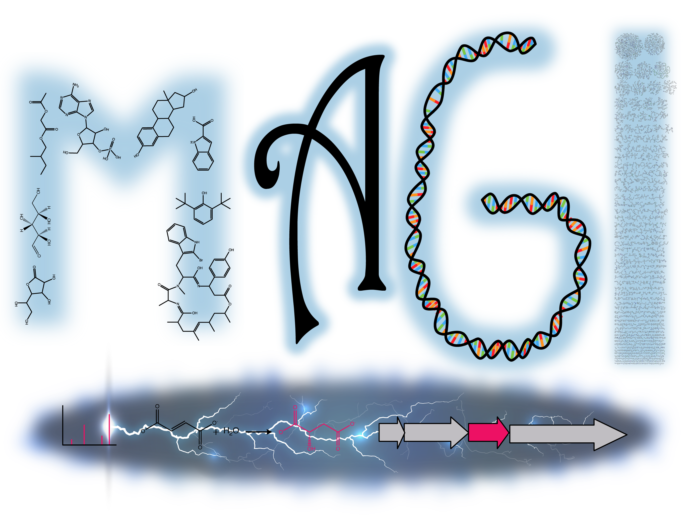

# Metabolites and Genes Integrated

Metagenomics and single-cell sequencing have enabled, for the first time, glimpses into the vast metabolic potential of Earth’s collective biological systems.  Yet, for the most part we can’t accurately predict nor identify the products of most biosynthetic pathways. Most of what we know of microbial biochemistry is based on characterization of a few model microorganisms, and these findings have been extended through sequence correlations to the rest of sequence space. Unfortunately, these extrapolations have questionable validity for the vast majority of environmental microbes and therefore requires fundamentally different approaches for directly linking novel sequences to their biochemical functions.

Our vision is to systematically explore dark-biochemistry, using state-of-the-art workflows that integrate large-scale DNA synthesis with metabolomics, high-performance computing, and chemoinformatics.  Bioinformatics mining of the over 500 billion unique genes catalogued by the DOE Joint Genome Institute can be used to prioritize high-novelty candidate biosynthesis clusters. Through synthetic biology approaches candidate clusters can be refactored and expressed in model organisms for characterization of the resulting biochemical activities and products with mass spectrometry. When integrated with novel chemoinformatic algorithms, this creates a closed-loop cycle of design, build, test, and learn for systematically mapping biochemical space.

For more documentation and a tutorial on how to analyze MAGI results, you can visit
[MAGI_web](https://magi.nersc.gov)
## Features

- Integrates a file of metabolites with a file of gene sequences
- A database of all publicly available reactions
- Compounds in those reactions
- API for accessing this information programmaticallly

## Local Installation (simple)

### Set up local settings and paths

The following will automatically set up your local settings files and adjust a couple paths in the .py files.

```bash
$ git clone https://github.com/biorack/magi.git
$ cd magi
$ python setup.py
```

The first step in the Python setup script will only work on Unix machines.
If you have a Windows machine, you will need to extract the database files manually and make sure they
are in the folder `/workflow/database/`. Then, go into `setup.py` and comment out or delete the lines corresponding to the
subprocess call that extracts the database tarball using Unix commands. Then you should be able to run the setup.py file as described above.

### Conda Environment Setup
First, install [Anaconda](https://www.anaconda.com/distribution/). 
[Conda](https://conda.io/docs/user-guide/install/index.html) or 
[miniconda](https://docs.anaconda.com/docs_oss/conda/install/quick#miniconda-quick-install-requirements) 
might also work, but I have not tested those.

```bash
$ conda env create -f magi_env.yml
$ source activate magi
# or Windows: 
$ activate magi
```

### Install NCBI BLAST

Two [NCBI BLAST](https://www.ncbi.nlm.nih.gov/guide/howto/run-blast-local/) 
binaries are required to run MAGI.

You may download the BLAST binaries appropriate for your machine 
[here](https://www.ncbi.nlm.nih.gov/guide/howto/run-blast-local/), 
and simply copy the `blastp` and `makeblastdb` binaries into `workflow/blastbin`.

### Test MAGI

To confirm everything was set up correctly, run the following test.
You will see some warnings; this is normal.
The test should take a few minutes.

```bash
$ cd tests/full_workflow_test/
$ ./run_full_workflow_test.sh
# or, in Windows, just copy the python command within run_full_workflow_test.sh
```

If you are interfacing with magi_web, you need to manually change a few things in magi_job/ :

1. change local settings import path in magi_job/utils.py
2. set absolute path to workflow/magi_workflow_20170519.py in job_data() in magi_job/utils.py

## Local Installation (custom)

### Install NCBI BLAST

Two [NCBI BLAST](https://www.ncbi.nlm.nih.gov/guide/howto/run-blast-local/) 
binaries are required to run MAGI.

You may download the BLAST binaries appropriate for your machine 
[here](https://www.ncbi.nlm.nih.gov/guide/howto/run-blast-local/), 
and simply copy the `blastp` and `makeblastdb` binaries into `workflow/blastbin`.

### Python Dependencies

* Python 2.7
* pandas
* numpy
* rdkit
* molVS
* networkx
* pytables

### Local Settings

`local_settings/` should contain (at least) 3 files:

* `local_settings.py`
* `user_settings.py`
* `__init__.py`

`local_settings.py` should just have one line in it describing the name of the user_settings.py file:

```python
SETTINGS_FILE = 'user_settings'
```

`user_settings.py` should have the following paths and variables defined:

```python
repo_location = ''        # path to repo location
blastbin =      ''        # path to BLAST binary
refseq_path =   ''        # path to reaction reference sequence library
refseq_db =     ''        # path to BLAST database for reference sequence library
mrs_reaction_path = ''    # path to metabolite-reaction-refseq database
compounds_df =  ''        # path to compounds database
mst_path =  ''            # path to chemical similarity network graph
chemnet_pickle = ''       # path to chemical similarity network descriptions

magi_results_storage = '' # path to where to store magi outputs and blast databases

# The next 2 lines are only required if you are interfacing with magi_web
magiwebsuperuser = ''     # admin username for magi_web
magiwebsuperuserpass = '' # admin password for magi_web
magiweburl = '' # URL to magi web (e.g. https://magi.nersc.gov)
```
When switching between machines or databases, you may have multiple `user_settings.py`
files that can be named whatever you want as long as the variable in `local_settings.py`
is defined correctly

## Acknowledgements
The development of MAGI was made possible by:
* [The U.S. Department of Energy Biological and Environmental Research Program](https://science.energy.gov/ber/)
* [Lawrence Berkeley National Laboratory](http://www.lbl.gov/)
* [The Joint Genome Institute](https://jgi.doe.gov/)
* [The National Energy Research Scientific Computing Center](http://www.nersc.gov/)
